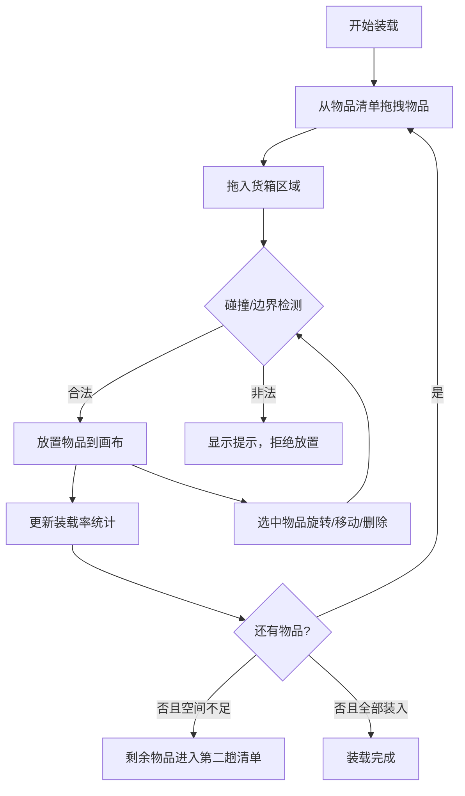

## 1. 产品概述

搬家货车装箱模拟器，帮助用户在搬家时合理规划货车空间，通过拖拽、旋转物品到虚拟货箱中，实现最优装载方案。装不下的物品自动进入第二趟清单。

- 核心功能：物品拖拽、90度旋转、碰撞检测、边界检测、装载率计算
- 目标用户：需要搬家的用户、搬家公司调度人员
- 产品价值：减少空间浪费、降低运输成本、提高装载效率

## 2. 核心功能

### 2.1 功能模块
1. **物品清单面板**：显示待装载物品列表，支持拖拽操作
2. **货箱画布**：可视化货箱空间，支持物品拖入、旋转、移动
3. **统计面板**：实时显示装载率、已用空间、剩余空间
4. **第二趟清单**：自动收集装不下的物品，支持重新装载

### 2.2 页面详情
| 页面名称 | 模块名称 | 功能描述 |
|----------|----------|----------|
| 主页面 | 物品清单面板 | 展示所有待装载物品，支持拖拽启动，显示物品尺寸和名称 |
| 主页面 | 货箱画布 | 矩形货箱空间，接收拖入物品，支持选中、拖拽移动、旋转、删除 |
| 主页面 | 统计面板 | 实时计算装载率百分比，显示已用面积/总面积，剩余空间可视化 |
| 主页面 | 第二趟清单 | 当物品无法放入货箱时自动移入此区域，支持重新拖回装载 |

## 3. 核心流程

用户从物品清单拖拽物品到货箱 → 系统检测碰撞和边界 → 合法位置放置物品 → 用户可选中物品进行旋转或微调位置 → 实时更新装载率 → 空间不足时物品自动进入第二趟清单

## 4. 用户界面设计

### 4.1 设计风格
- 主色调：工业风橙色系 (#F97316) 搭配深灰蓝 (#1E293B)，体现物流搬运的专业感
- 辅助色：绿色表示成功/合法，红色表示警告/冲突
- 按钮风格：圆角 8px，带微阴影，hover 状态有轻微缩放
- 字体：使用 Space Grotesk 或类似现代无衬线字体，数字用等宽字体
- 布局风格：三栏式布局，左侧物品清单，中间货箱画布，右侧统计与第二趟清单
- 图标风格：Lucide 线性图标，简洁专业

### 4.2 页面设计概述
| 页面名称 | 模块名称 | UI 元素 |
|----------|----------|----------|
| 主页面 | 顶部导航 | 标题 "搬家装箱助手"，重置按钮，帮助提示 |
| 主页面 | 物品清单面板 | 卡片式物品列表，显示物品名称、尺寸缩略图、可拖拽状态 |
| 主页面 | 货箱画布 | 网格背景矩形区域，物品以彩色矩形展示，选中状态有高亮边框，拖拽时半透明预览 |
| 主页面 | 统计面板 | 大号百分比数字，进度条动画，已用/剩余空间文字说明 |
| 主页面 | 第二趟清单 | 独立卡片区域，淡红色背景提示，物品可重新拖回货箱 |

### 4.3 响应性
- 桌面端优先（≥1280px）：三栏并排布局
- 平板端（768-1279px）：左右栏折叠为可展开抽屉
- 移动端（<768px）：纵向堆叠布局，画布优先展示
- 触控优化：增大触控区域，长按触发旋转菜单

