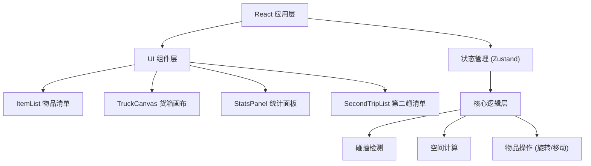
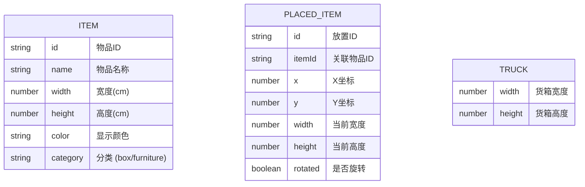

## 1. 架构设计



## 2. 技术描述
- 前端：React@18 + TypeScript + Vite
- 样式：TailwindCSS@3
- 状态管理：Zustand
- 图标：Lucide React
- 后端：无（纯前端应用）
- 数据库：无（使用本地 mock 数据）

## 3. 路由定义
| 路由 | 用途 |
|------|------|
| / | 主页面 - 装箱模拟器 |

## 4. 数据模型

### 4.1 数据模型定义



### 4.2 TypeScript 类型定义

```typescript
interface Item {
  id: string;
  name: string;
  width: number;
  height: number;
  color: string;
  category: 'box' | 'furniture';
}

interface PlacedItem {
  id: string;
  itemId: string;
  x: number;
  y: number;
  width: number;
  height: number;
  rotated: boolean;
}

interface TruckState {
  width: number;
  height: number;
  placedItems: PlacedItem[];
  pendingItems: Item[];
  secondTripItems: Item[];
  selectedId: string | null;
}
```

## 5. 核心算法

### 5.1 碰撞检测
- AABB 轴对齐包围盒检测：判断两个矩形是否重叠
- 边界检测：确保物品坐标在货箱范围内

### 5.2 空间计算
- 已用面积 = Σ(放置物品面积)
- 装载率 = 已用面积 / 货箱总面积 × 100%
- 剩余面积 = 货箱总面积 - 已用面积

### 5.3 物品旋转
- 90度旋转：交换 width 和 height，保持中心点不变或重新定位
